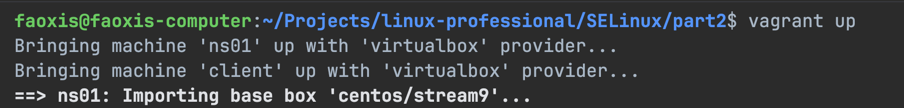
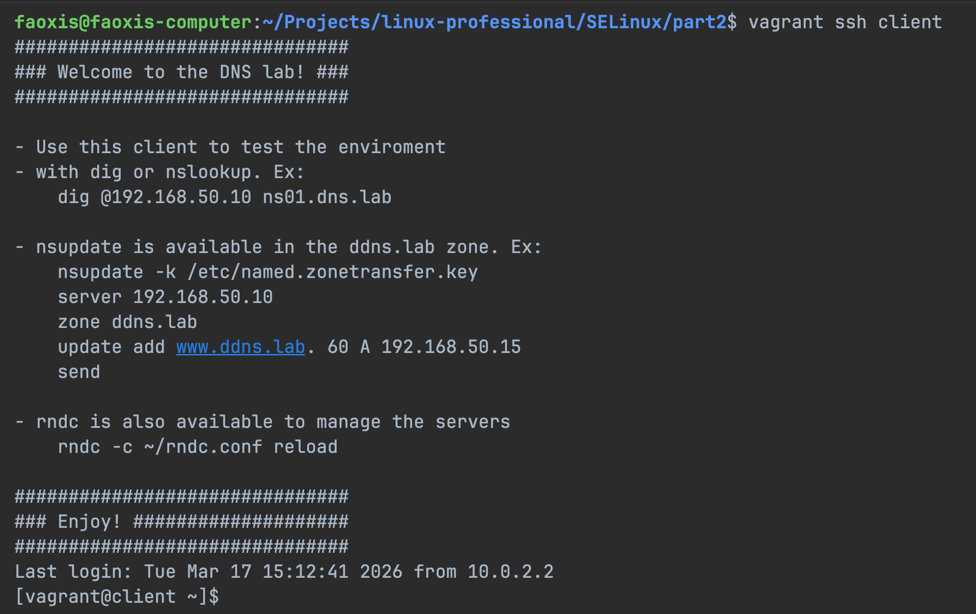
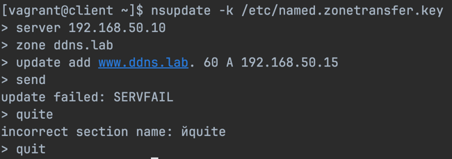
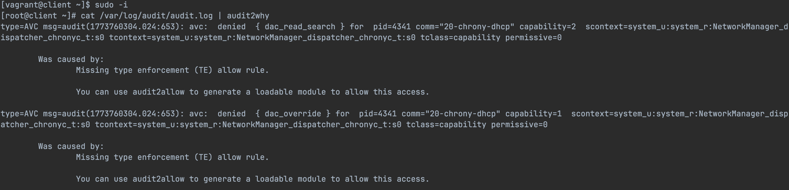
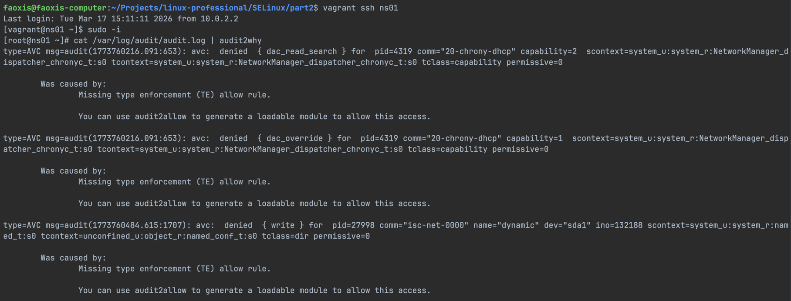
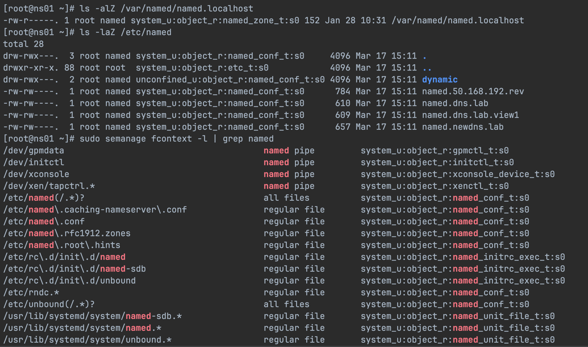
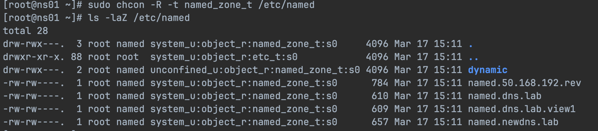
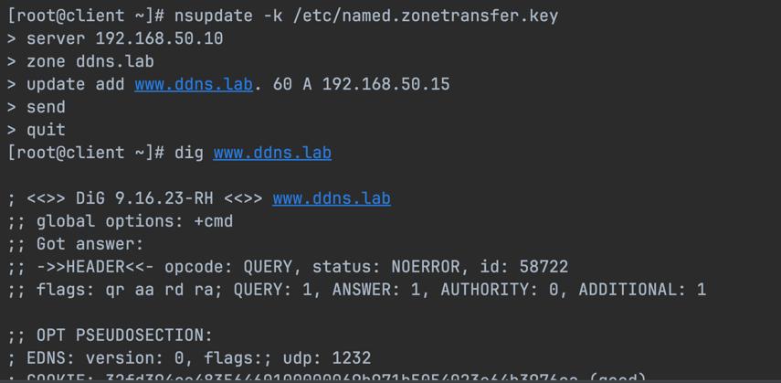
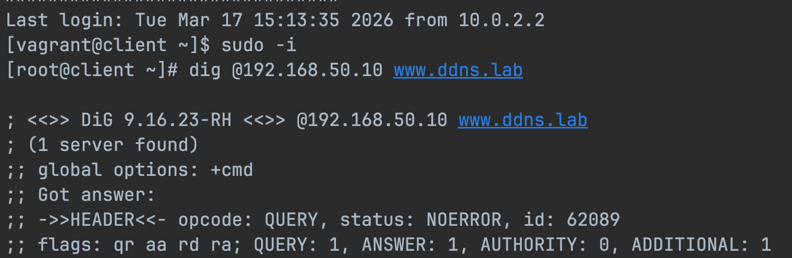

# SELinux. Часть 2 — DNS (named)

## Порядок действий

### 1. Поднимаем виртуальные машины

Запускаем окружение командой `vagrant up`.

### 2. Подключаемся к клиенту

### 3. Пытаемся внести изменения в зону

Попытка обновить зону завершается ошибкой.

### 4. Смотрим лог ошибок

### 5. Подключаемся к серверу

Не закрывая сессию клиента, подключаемся к серверу и видим ошибку.

### 6. Сопоставляем расположение конфигураций

Сравниваем расположение конфигураций в настройках с их фактическим местом хранения.

### 7. Изменяем тип контекста безопасности

Меняем тип контекста безопасности для каталога и проверяем результат.

### 8. Проверяем работу клиента

Снова пробуем внести изменения через клиент — всё работает.

### 9. Проверяем после перезагрузки

После перезагрузки хостов убеждаемся, что всё по-прежнему работает.

Перезагрузка никак не сказалась на работоспособности.
