# Работа с загрузчиков

## Подготовительная работа
Была установлена виртуальная машина Ubuntu 24.04 с LVM
Проверим:

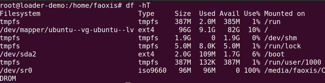

Как видно из команды - корень действительно находится в logical volume.

## Добавляем таймаут в grub загрузчик
- Добавим таймаут в граб настройки

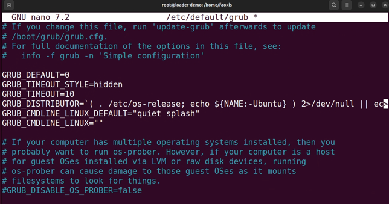
- Выполним `update-grub` и `reboot`. Посмотрим на резултат

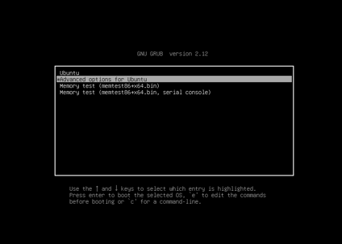

Делаем вывод о том, что `grub` консоль действительно появилась

## Попробуем выполнить вход без пароля
### 1 способ
- При загрузке указываем `init=/bin/bash`

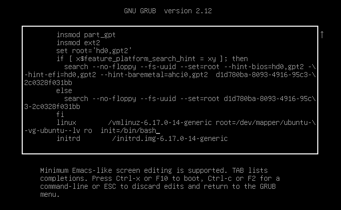

- Выполним перемонтирование системы с правами rw с помощью команд `mount -o remount,rw /` и `mount | grep root`

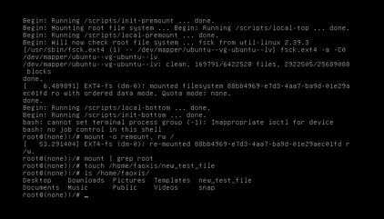

По дальнейшей работе видно, что мы имеем полный доступ к системе
### 2 способ
- Перейдем в `recovery mode`, разрешим сеть параметром `network` и перейдем в `root`

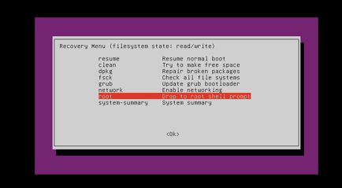

- Попробуем создать файл и проверим, что все работает

Оба способа успешно сработали

## Переименуем VG
- Переименовываем с помощью `vgrename`

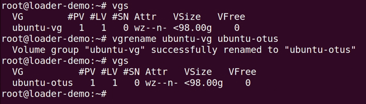

- Переименуем настройки группы в `/etc/grub/grub.cfg`

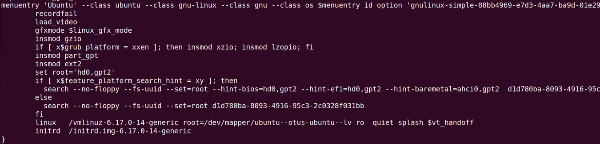
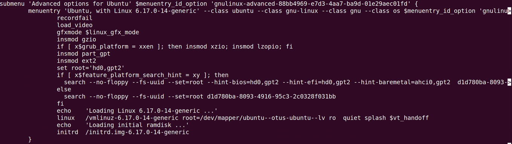
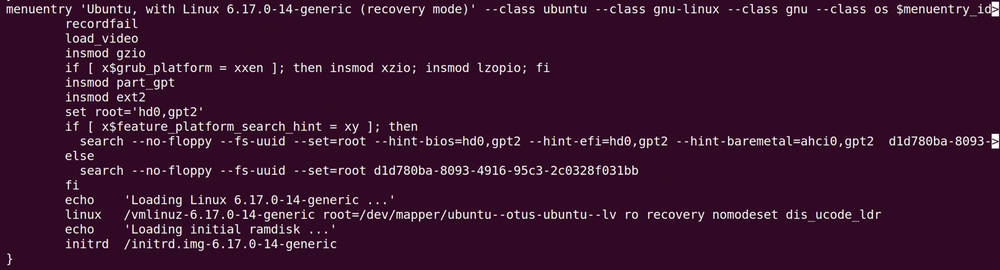

- При загрузке убеждаемся, что выставлены правильные параметры

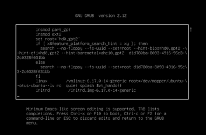

- Запускаем систему и убеждаемся в имени vg группы

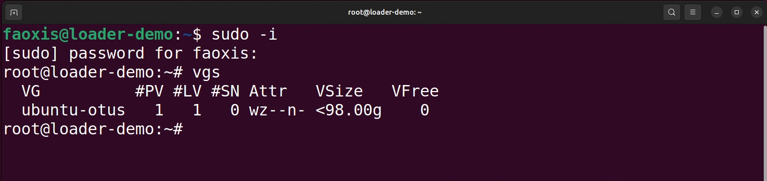
