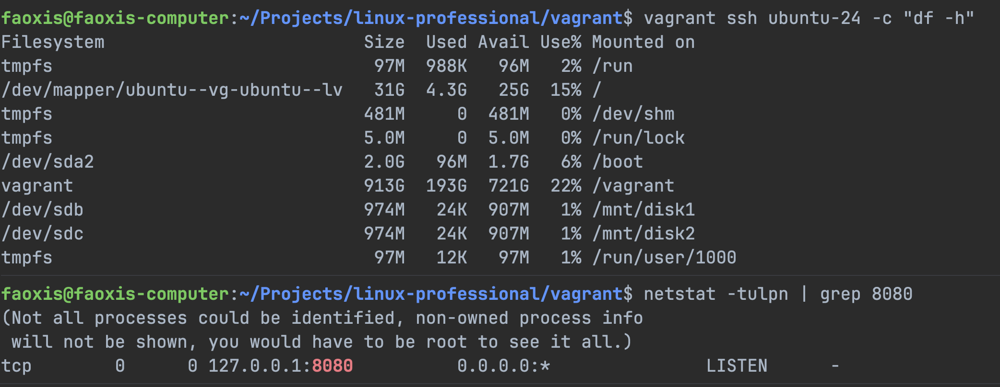

# Домашнее задание: Vagrant

## 1. Подготовка окружения

- Убедиться, что установлены **VirtualBox** и **Vagrant**.
- Создать директорию для проекта.

## 2. Создание базовой виртуальной машины

- Использовать любой образ (box).
- Настроить память ВМ: **1024 МБ**.

## 3. Добавление дисков

- Добавить **2 виртуальных диска** размером **1 ГБ** каждый.

## 4. Настройка сети

- Настроить проброс порта: **80** (гостевая) → **8080** (хост).

## 5. Провижининг

Написать провижининг-скрипт, который:

1. Форматирует добавленные диски в файловую систему **ext4**.
2. Создаёт точки монтирования `/mnt/disk1` и `/mnt/disk2`.
3. Монтирует диски в указанные директории.
4. Добавляет записи в `/etc/fstab` для автоматического монтирования при загрузке.

## Результаты

### Вывод `df -h`

## Формат сдачи

- Ссылка на git-репозиторий с проектом.
- Репозиторий должен содержать `Vagrantfile`.
- Скриншот вывода команды `df -h` с запущенной ВМ.
- Скриншот вывода команды `netstat -tulpn | grep 8080` с хостовой машины при запущенной ВМ.
